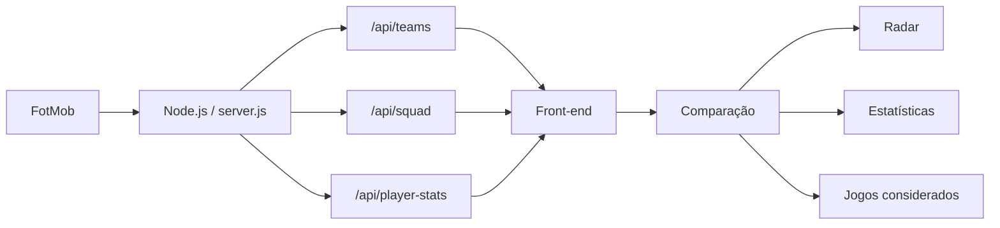

# ⚽ Duelo Brasileirão

Aplicação web para **comparação de jogadores do Brasileirão Série A 2026**, utilizando dados reais de desempenho.

O projeto permite selecionar dois jogadores e comparar suas estatísticas através de um **gráfico radar**, além de visualizar os números detalhados e as partidas consideradas no período selecionado.

## 🚀 Funcionalidades

- Comparação entre dois jogadores
- Dados do Brasileirão Série A 2026
- Seleção por clube
- Filtro por posição
- Comparação da temporada completa
- Comparação dos últimos 5 jogos do jogador
- Comparação dos últimos 10 jogos do jogador
- Visualização dos jogos considerados no cálculo
- Gráfico radar para comparação de desempenho
- Interface responsiva
- Dados obtidos dinamicamente do FotMob

### Métricas do gráfico radar

O radar compara:

- Gols
- Assistências
- Passes
- Finalizações
- Desarmes
- Chutes no alvo

Os valores são normalizados para uma escala de **0 a 100**, permitindo comparar métricas que possuem escalas diferentes.

### Estatísticas adicionais

Além do radar, a comparação numérica apresenta:

- Minutos jogados
- Cartões amarelos
- Cartões vermelhos
- Gols
- Assistências
- Passes
- Finalizações
- Desarmes
- Chutes no alvo

## 🕹️ Jogos considerados

Ao selecionar:

- **Últimos 5 jogos do jogador**
- **Últimos 10 jogos do jogador**

a aplicação exibe as partidas utilizadas para gerar as estatísticas.

Cada partida pode apresentar informações como:

- Data
- Adversário
- Placar
- Mandante e visitante
- Minutos jogados
- Gols
- Assistências

Isso permite verificar exatamente quais partidas fazem parte do período analisado.

## 🛠️ Tecnologias

### Front-end

- HTML5
- CSS3
- JavaScript
- Chart.js

### Back-end

- Node.js
- API REST
- Fetch API
- Manipulação e normalização de dados JSON

### Fonte de dados

Os dados esportivos são obtidos através de endpoints utilizados pelo **FotMob**.

> Este é um projeto independente, criado para fins educacionais e de portfólio. Não possui vínculo ou afiliação oficial com FotMob, CBF ou Campeonato Brasileiro.

## 🏗️ Arquitetura



O navegador não acessa diretamente a fonte externa.

O fluxo é:

```text
FotMob
   ↓
Node.js
   ↓
API interna
   ↓
JavaScript
   ↓
Interface
   ↓
Comparação dos jogadores
```

Essa separação permite tratar e padronizar os dados no servidor antes de enviá-los para a interface.

## 📁 Estrutura do projeto

```text
duelo-brasileirao/
│
├── .github/
│   └── workflows/
│       └── ci.yml
│
├── public/
│   ├── app.js
│   ├── index.html
│   └── styles.css
│
├── .editorconfig
├── .env.example
├── .gitignore
├── LICENSE
├── package.json
├── README.md
├── server.js
└── start-windows.bat
```

## ▶️ Como executar

### Requisitos

- Node.js 20 ou superior
- Git

Clone o repositório:

```bash
git clone https://github.com/jmmedeiross/duelo-brasileirao.git
```

Entre na pasta:

```bash
cd duelo-brasileirao
```

Inicie o servidor:

```bash
npm start
```

No Windows também é possível utilizar:

```powershell
npm.cmd start
```

Depois acesse:

```text
http://localhost:3001
```

## 🔌 API interna

O back-end funciona como uma camada intermediária entre a interface e a fonte de dados.

Algumas das rotas utilizadas pelo projeto são:

```text
GET /api/health
GET /api/teams
GET /api/squad
GET /api/player-stats
```

### Exemplo do fluxo

Ao escolher um clube:

```text
Front-end
   ↓
/api/squad
   ↓
Node.js
   ↓
FotMob
   ↓
Elenco
```

Ao escolher um jogador:

```text
Front-end
   ↓
/api/player-stats
   ↓
Node.js
   ↓
FotMob
   ↓
Estatísticas
   ↓
Gráfico + tabela
```

## 📊 Normalização do radar

As estatísticas possuem escalas muito diferentes.

Por exemplo:

```text
Gols: 10
Passes: 1200
Desarmes: 40
```

Colocar esses valores diretamente no mesmo gráfico faria os passes dominarem completamente a visualização.

Por isso, o sistema normaliza as métricas para uma escala relativa de:

```text
0 ───────────── 100
```

Os valores reais continuam disponíveis na tabela de comparação.

## ⚙️ Configuração

A aplicação utiliza por padrão:

```text
Porta: 3001
Temporada: 2026
Competição: Brasileirão Série A
```

Caso queira utilizar outra porta:

### PowerShell

```powershell
$env:PORT=3002
npm.cmd start
```

### Linux / macOS

```bash
PORT=3002 npm start
```

## ✅ Validação

O projeto possui validação automática através do GitHub Actions.

Também é possível executar localmente:

```bash
npm test
```

O objetivo é detectar problemas de sintaxe antes que alterações sejam integradas ao projeto.

## 🎯 Objetivo do projeto

O projeto foi desenvolvido como parte do meu portfólio de desenvolvimento Full Stack, com foco em demonstrar conhecimentos em:

- Consumo de APIs
- Desenvolvimento Back-end com Node.js
- Desenvolvimento Front-end
- JavaScript
- Manipulação de JSON
- Integração Front-end / Back-end
- Visualização de dados
- Tratamento e normalização de dados
- Git e GitHub
- Organização de projeto
- Interface responsiva

## 🔮 Próximas melhorias

Algumas evoluções possíveis:

- Comparação de mais de dois jogadores
- Busca de jogador por nome
- Ranking de jogadores por posição
- Estatísticas por 90 minutos
- Média por partida
- Histórico de confrontos
- Comparação entre temporadas
- Página individual de jogador
- Persistência de favoritos
- Deploy público da aplicação
- Testes automatizados adicionais

## ⚠️ Observação sobre os dados

O projeto utiliza dados provenientes de endpoints públicos utilizados pelo FotMob.

Como esses endpoints não fazem parte de uma API pública oficialmente garantida para terceiros, sua estrutura pode sofrer alterações no futuro.

O projeto possui tratamento e adaptação dos dados no back-end para reduzir o impacto dessas mudanças.

## 👨‍💻 Autor

**João Medeiros**

Desenvolvedor Full Stack

- GitHub: [github.com/jmmedeiross](https://github.com/jmmedeiross)
- LinkedIn: [linkedin.com/in/jmmedeiross](https://linkedin.com/in/jmmedeiross)

## 📄 Licença

Este projeto está disponível sob a licença MIT.

Consulte o arquivo [LICENSE](LICENSE) para mais informações.
